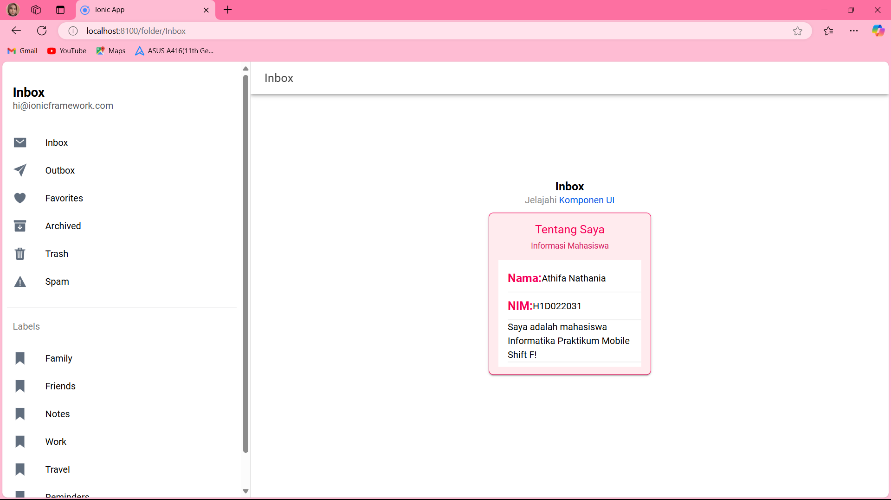

**Nama**       : Athifa Nathania  
**NIM**        : H1D022031  
**Shift Baru** : F
**Shift Lama** : D

# Proyek Contoh Ionic

## Menambahkan Komponen di Halaman Ionic
Ini adalah contoh proyek menggunakan Ionic Framework yang menunjukkan cara menampilkan informasi tentang diri sendiri menggunakan komponen Ionic.

### Langkah-langkah untuk Menambahkan Komponen

1. **Buat Proyek Ionic Baru (Jika Belum Ada)**:
   Jika belum memiliki proyek Ionic, buatlah proyek baru dengan menggunakan perintah berikut:
   ```bash
   ionic start cobaApp
   ```
   kemudian pilih sidemenu dan angular

2. **Buka Halaman yang Ingin Diedit**:
   Akses folder proyek dan buka file halaman yang ingin di edit. Disini saya ingin menambahkan komponen di halaman `folder`, buka `folder.page.html` dan `folder.page.scss`.

3. **Menambahkan Komponen Ionic**:
   - Gunakan komponen yang tersedia dalam Ionic. Dalam contoh ini, saya akan menambahkan `ion-card` dan `ion-item`.
   - Berikut adalah contoh kode yang telah saya buat:
   
   ```html
   <ion-card>
     <ion-card-header>
       <ion-card-title>Tentang Saya</ion-card-title>
       <ion-card-subtitle>Informasi Mahasiswa</ion-card-subtitle>
     </ion-card-header>

     <ion-card-content>
       <ion-list>
         <ion-item>
           <strong>Nama: </strong> Athifa Nathania
         </ion-item>
         <ion-item>
           <strong>NIM: </strong> H1D022031
         </ion-item>
         <ion-item>
           Saya adalah mahasiswa Informatika Praktikum Mobile Shift F!
         </ion-item>
       </ion-list>
     </ion-card-content>
   </ion-card>
   ```

4. **Menambahkan CSS untuk Styling**:
   - Buka file `folder.page.scss` untuk menambahkan gaya pada komponen yang baru ditambahkan:
   
   ```scss
   ion-card {
     background-color: #ffebee;
     border: 1px solid #f50057;
     border-radius: 8px;
   }

   ion-item {
     background-color: #ffffff !important;
     color: #000000 !important;
   }
   ```

5. **Simpan Perubahan**:
   Setelah menambahkan komponen dan gaya, simpan perubahan.

6. **Jalankan Aplikasi**:
   Gunakan perintah berikut untuk menjalankan aplikasi dan melihat hasilnya di browser:
   ```bash
   ionic serve
   ```

### Hasil Akhir
Setelah mengikuti langkah-langkah di atas, dapat di lihat tampilan seperti di bawah ini:


